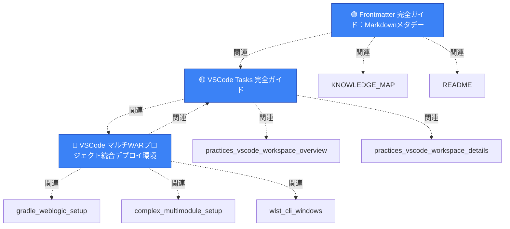
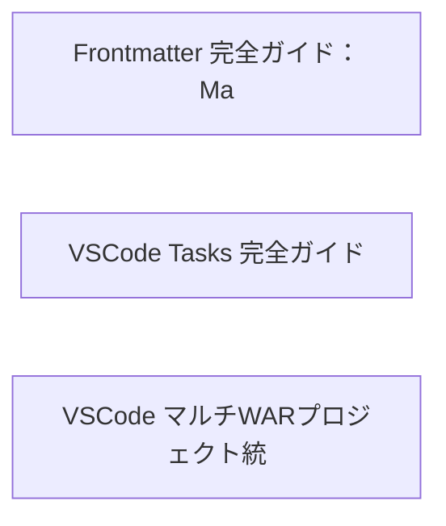

# ナレッジグラフ（Mermaid 可視化）

> Frontmatter の `related` フィールドに基づくドキュメント間の関連性を可視化

## 凡例

- 🟢 **Beginner** - 初心者向け
- 🟡 **Intermediate** - 中級者向け
- 🔴 **Advanced** - 上級者向け

## カテゴリ別の色分け

- 🔵 **Practices** - 実践ガイド
- 🟢 **Concepts** - 概念説明
- 🟠 **Templates** - テンプレート

---

## 全体グラフ



---

## カテゴリ別グラフ

### Practices



---

## タグ別ドキュメント数

| タグ | ドキュメント数 |
|------|---------------|
| `vscode` | 2 |
| `tasks` | 2 |
| `frontmatter` | 1 |
| `yaml` | 1 |
| `markdown` | 1 |
| `documentation` | 1 |
| `knowledge-management` | 1 |
| `metadata` | 1 |
| `automation` | 1 |
| `build-tools` | 1 |
| `debugging` | 1 |
| `weblogic` | 1 |
| `gradle` | 1 |
| `wlst` | 1 |
| `deployment` | 1 |
| `multi-module` | 1 |
| `java` | 1 |

---

**自動生成日時**: このファイルは `scripts/generate-mermaid-graph.py` で自動生成されます。

**更新方法**:
```bash
python3 scripts/generate-mermaid-graph.py
```
