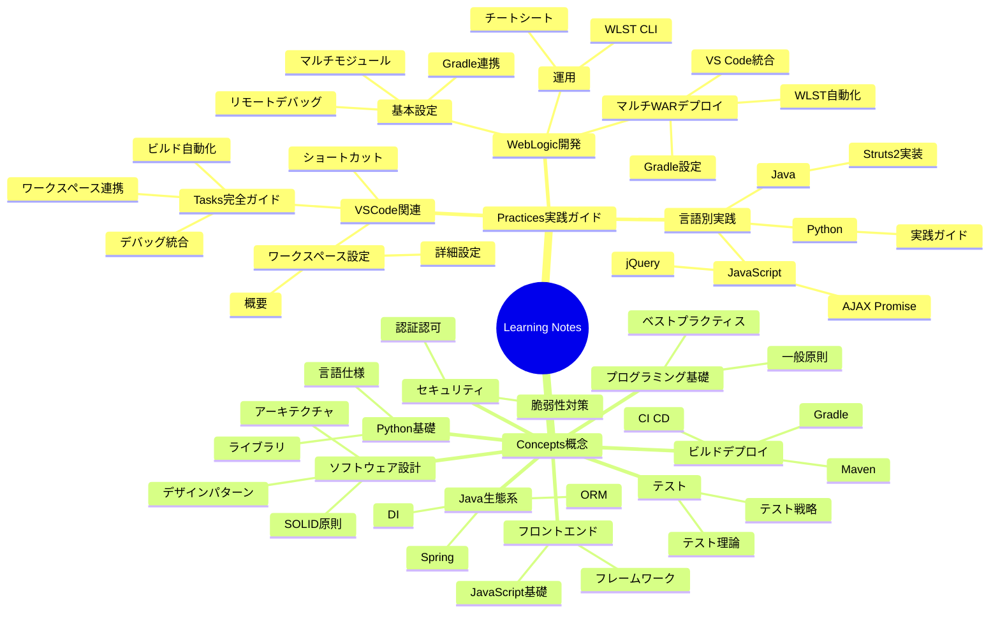
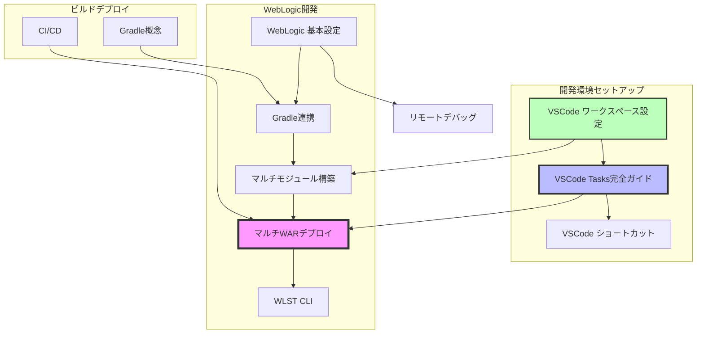
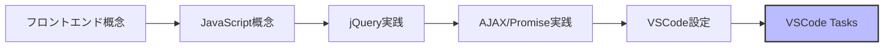
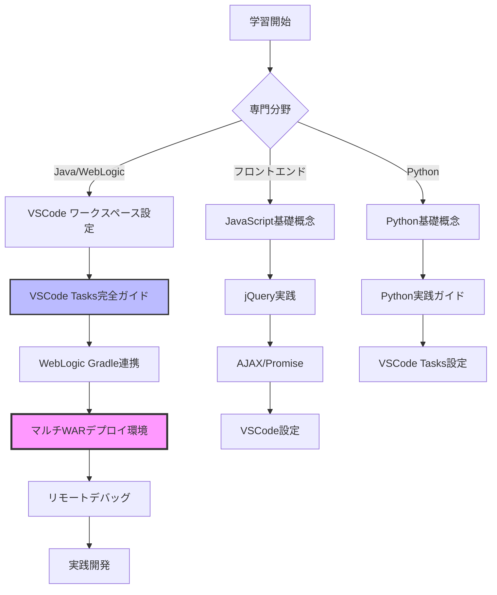
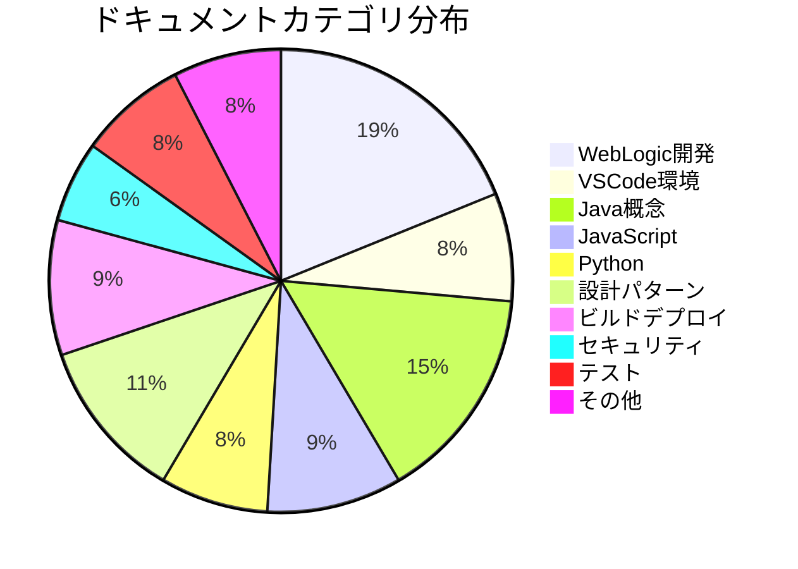
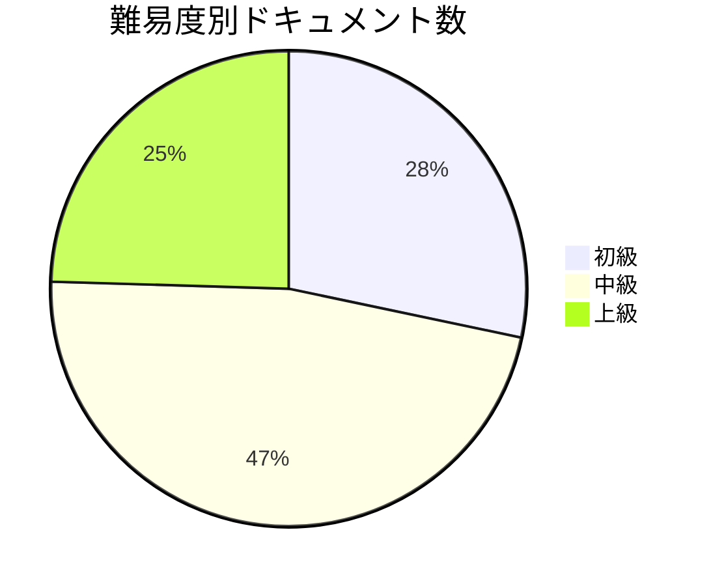

# Learning Notes ナレッジマップ

> 学習ノート全体の関連性と構造を可視化

最終更新: 2025-12-12

---

## 📊 全体構造マインドマップ



---

## 🔗 技術スタック別の関連性グラフ

### Java + WebLogic 開発スタック



### フロントエンド開発スタック



### 全体フロー（初学者向け学習パス）



---

## 🏷️ タグ一覧

### 開発環境・ツール
- `#vscode` - VS Code 関連（10 documents）
- `#tasks` - タスク自動化（2 documents）
- `#workspace` - ワークスペース設定（3 documents）
- `#shortcuts` - キーボードショートカット（1 document）

### バックエンド技術
- `#weblogic` - WebLogic サーバー（9 documents）
- `#gradle` - Gradle ビルドツール（5 documents）
- `#wlst` - WLST スクリプト（3 documents）
- `#java` - Java プログラミング（15 documents）
- `#spring` - Spring Framework（3 documents）
- `#struts2` - Struts2 フレームワーク（1 document）

### フロントエンド技術
- `#javascript` - JavaScript（8 documents）
- `#jquery` - jQuery（1 document）
- `#ajax` - AJAX/非同期通信（1 document）
- `#frontend` - フロントエンド全般（5 documents）

### Python
- `#python` - Python プログラミング（5 documents）

### ソフトウェア設計
- `#solid` - SOLID 原則（2 documents）
- `#design-patterns` - デザインパターン（3 documents）
- `#architecture` - アーキテクチャ（2 documents）

### ビルド・デプロイ
- `#build` - ビルド自動化（5 documents）
- `#deployment` - デプロイメント（4 documents）
- `#ci-cd` - CI/CD（2 documents）

### その他
- `#security` - セキュリティ（3 documents）
- `#testing` - テスト（4 documents）
- `#orm` - ORM（2 documents）
- `#di` - 依存性注入（2 documents）

---

## 📚 ディレクトリ別ドキュメント一覧

### Practices（実践ガイド）

#### VSCode 関連 `#vscode` `#editor`
| ドキュメント | タグ | 難易度 | 関連 |
|------------|------|--------|------|
| [Tasks 完全ガイド](practices/vscode-tasks-complete-guide.md) | `#tasks` `#automation` `#build` | 中級 | ワークスペース設定、WebLogic マルチWAR |
| [ワークスペース設定概要](practices/vscode-workspace-overview.md) | `#workspace` `#configuration` | 初級 | Tasks完全ガイド |
| [ワークスペース詳細](practices/vscode-workspace-details.md) | `#workspace` `#configuration` | 中級 | ワークスペース概要 |
| [ショートカットリファレンス](practices/vscode-shortcuts-reference.md) | `#shortcuts` `#productivity` | 初級 | - |

#### WebLogic 関連 `#weblogic` `#java` `#deployment`
| ドキュメント | タグ | 難易度 | 関連 |
|------------|------|--------|------|
| [マルチWARデプロイ環境](practices/weblogic/vscode-gradle-wlst-multi-war-deployment.md) | `#gradle` `#wlst` `#multi-module` | 上級 | Tasks完全ガイド、Gradle連携 |
| [Gradle WebLogic連携](practices/weblogic/vscode-gradle-weblogic-setup.md) | `#gradle` `#build` | 中級 | マルチWARデプロイ |
| [リモートデバッグ](practices/weblogic/vscode-weblogic-debug.md) | `#debug` `#development` | 中級 | WebLogic設定 |
| [複雑なマルチモジュール構築](practices/weblogic/vscode-complex-multimodule-setup.md) | `#multi-module` `#eclipse` | 上級 | Gradle連携 |
| [マルチプロジェクトワークスペース](practices/weblogic/vscode-multi-project-workspace.md) | `#workspace` `#multi-project` | 中級 | ワークスペース設定 |
| [Spring Gradle WebLogic](practices/weblogic/vscode-spring-gradle-weblogic.md) | `#spring` `#gradle` | 中級 | Gradle連携 |
| [Eclipse classpath 再利用](practices/weblogic/vscode-eclipse-classpath-reuse.md) | `#eclipse` `#migration` | 中級 | マルチモジュール構築 |
| [WebLogic チートシート](practices/weblogic/vscode-weblogic-cheatsheet.md) | `#reference` `#quick-guide` | 初級 | - |
| [WLST CLI (Windows)](practices/weblogic/wlst-cli-windows.md) | `#wlst` `#cli` `#windows` | 中級 | マルチWARデプロイ |
| [WebLogic 設定](practices/weblogic/weblogic-configuration.md) | `#configuration` `#setup` | 初級 | - |

#### 言語別実践
| ドキュメント | タグ | 難易度 |
|------------|------|--------|
| [Struts2 実装](practices/java/struts2/struts2-implementation.md) | `#struts2` `#java` `#web` | 中級 |
| [jQuery 実践](practices/javascript/jquery-practices.md) | `#jquery` `#javascript` | 初級 |
| [AJAX/Promise 実践](practices/javascript/ajax-promise-practices.md) | `#ajax` `#promise` `#async` | 中級 |
| [Python 実践](practices/python/python-practices.md) | `#python` | 初級 |

### Concepts（概念）

#### ビルド・デプロイ `concepts/4.build-deploy/`
- Gradle 概念
- Maven 概念
- CI/CD パイプライン

#### ソフトウェア設計 `concepts/4.software-design/`
- SOLID 原則
- デザインパターン
- アーキテクチャパターン

#### Java 生態系 `concepts/java/`
- Spring Framework
- ORM（Hibernate, JPA）
- 依存性注入（DI）

#### フロントエンド `concepts/5.javascript-frontend/`
- JavaScript 基礎
- フレームワーク概念

#### その他
- `concepts/6.security/` - セキュリティ概念
- `concepts/7.testing-theory/` - テスト理論
- `concepts/programming/` - プログラミング基礎
- `concepts/python/` - Python 概念

---

## 🎯 推奨学習パス

### 1. Java + WebLogic 開発者向け（完全初心者）

**目標**: WebLogic でのマルチモジュール Java アプリケーション開発

```
1. VSCode ワークスペース設定概要 (1時間)
   ↓
2. VSCode Tasks 完全ガイド (2-3時間)
   ↓
3. WebLogic 基本設定 (30分)
   ↓
4. Gradle WebLogic 連携 (1時間)
   ↓
5. マルチWARデプロイ環境 (2時間)
   ↓
6. リモートデバッグ (1時間)
   ↓
7. 実践開発
```

### 2. Java + WebLogic 開発者向け（中級者）

**前提**: Java, Gradle の基礎知識あり

```
1. VSCode Tasks 完全ガイド (ワークスペース連携セクションのみ)
   ↓
2. マルチWARデプロイ環境 (全体)
   ↓
3. WLST CLI (必要に応じて)
```

### 3. フロントエンド開発者向け

**目標**: JavaScript モダン開発環境構築

```
1. VSCode ワークスペース設定
   ↓
2. VSCode Tasks (JavaScript/Node.js セクション)
   ↓
3. JavaScript 概念 (concepts/)
   ↓
4. jQuery 実践
   ↓
5. AJAX/Promise 実践
```

### 4. Python 開発者向け

**目標**: Python 開発環境と自動化

```
1. VSCode Tasks (Python セクション)
   ↓
2. Python 概念
   ↓
3. Python 実践ガイド
```

---

## 🔍 関連性マトリクス

主要ドキュメント間の関連度を数値化（0.0-1.0）

| From → To | Tasks | WebLogic<br/>マルチWAR | Gradle<br/>連携 | ワークスペース<br/>設定 |
|-----------|-------|-------------------|--------------|------------------|
| **Tasks完全ガイド** | - | 0.9 | 0.7 | 0.8 |
| **WebLogic マルチWAR** | 0.9 | - | 0.9 | 0.7 |
| **Gradle連携** | 0.7 | 0.9 | - | 0.5 |
| **ワークスペース設定** | 0.8 | 0.7 | 0.5 | - |
| **リモートデバッグ** | 0.5 | 0.7 | 0.6 | 0.4 |
| **マルチモジュール構築** | 0.6 | 0.8 | 0.8 | 0.7 |

**凡例:**
- 0.8-1.0: 強い関連性（必須の前提知識）
- 0.5-0.7: 中程度の関連性（推奨）
- 0.0-0.4: 弱い関連性（参考程度）

---

## 📈 統計情報

### ドキュメント数
- **合計**: 53 ドキュメント
- **Practices**: 17 ドキュメント
  - VSCode: 4 ドキュメント
  - WebLogic: 10 ドキュメント
  - 言語別: 3 ドキュメント
- **Concepts**: 30+ ドキュメント
- **Templates**: 3 テンプレート

### カテゴリ別分布



### 難易度分布



---

## 🛠️ メンテナンス

### このマップの更新方法

1. **新しいドキュメントを追加した場合**
   - Frontmatter にタグを追加
   - このファイルのマインドマップを更新
   - タグ一覧を更新
   - `scripts/generate-tag-index.py` を実行

2. **関連性が変わった場合**
   - 該当ドキュメントの Frontmatter の `related` セクションを更新
   - 関連性グラフを更新

3. **自動更新スクリプト**
   ```bash
   # タグインデックスの再生成
   python3 scripts/generate-tag-index.py

   # リンク切れチェック
   python3 scripts/validate-links.py
   ```

---

## 📝 今後の拡張予定

- [ ] Obsidian Graph View との連携
- [ ] 自動タグ提案機能
- [ ] ドキュメント品質スコアリング
- [ ] 学習進捗トラッキング
- [ ] インタラクティブナレッジグラフ（D3.js）

---

> このナレッジマップは自動生成スクリプトと手動メンテナンスの組み合わせで管理されています。
> 最終更新: 2025-12-12 | メンテナ: [@m-miyawaki]
