# CI/CD学習ノート

> 対象: Jenkins, GitLab CI, GitHub Actions
> 環境: Java, Spring Boot, Gradle, Git

## 学習目標

- CI/CDの概念と必要性を理解する
- 継続的インテグレーション（CI）と継続的デリバリー/デプロイメント（CD）の違いを理解する
- パイプラインを設計・実装できる
- 自動テスト戦略を理解し、実践できる
- 主要なCI/CDツールを使えるようになる

---

## 4.4.1 継続的インテグレーション（CI）

### 概要

**継続的インテグレーション（Continuous Integration）** は、開発者が頻繁にコードをメインブランチに統合し、その都度自動的にビルド・テストを実行する開発プラクティスです。

### CI以前の問題

```
開発者A: 1週間独自ブランチで開発
開発者B: 1週間独自ブランチで開発
↓
統合時に大量のコンフリクト発生 😱
↓
「俺の環境では動くんだけど...」問題
```

### CIによる解決

```
開発者が変更をコミット
  ↓
自動的にトリガー
  ↓
ビルド・テストを自動実行
  ↓
成功 ✅ / 失敗 ❌ を即座に通知
```

### CIの基本フロー

```mermaid
graph LR
    A[コミット] --> B[ソースコード取得]
    B --> C[依存関係解決]
    C --> D[ビルド]
    D --> E[単体テスト]
    E --> F[静的解析]
    F --> G[結果通知]
```



### 実装例: GitLab CI

```yaml
# .gitlab-ci.yml
stages:
  - build
  - test
  - analyze

build:
  stage: build
  image: openjdk:17
  script:
    - ./gradlew clean build -x test
  artifacts:
    paths:
      - build/libs/*.jar
    expire_in: 1 day

unit-test:
  stage: test
  image: openjdk:17
  script:
    - ./gradlew test
  artifacts:
    reports:
      junit: build/test-results/test/*.xml

code-analysis:
  stage: analyze
  image: openjdk:17
  script:
    - ./gradlew sonarqube -Dsonar.host.url=$SONAR_URL
  only:
    - main
```

### 実装例: GitHub Actions

```yaml
# .github/workflows/ci.yml
name: CI

on:
  push:
    branches: [ main, develop ]
  pull_request:
    branches: [ main ]

jobs:
  build:
    runs-on: ubuntu-latest

    steps:
    - uses: actions/checkout@v3

    - name: Set up JDK 17
      uses: actions/setup-java@v3
      with:
        java-version: '17'
        distribution: 'temurin'

    - name: Cache Gradle packages
      uses: actions/cache@v3
      with:
        path: ~/.gradle/caches
        key: ${{ runner.os }}-gradle-${{ hashFiles('**/*.gradle*') }}

    - name: Build with Gradle
      run: ./gradlew build

    - name: Run tests
      run: ./gradlew test

    - name: Upload test results
      if: always()
      uses: actions/upload-artifact@v3
      with:
        name: test-results
        path: build/test-results/
```

### CIのベストプラクティス

1. **頻繁にコミットする**（少なくとも1日1回）
2. **ビルドは高速に**（10分以内が理想）
3. **テストを自動化する**
4. **ビルド失敗は最優先で修正**
5. **全員が最新のビルド状況を確認できる**

---

## 4.4.2 継続的デリバリー/デプロイメント（CD）

### 継続的デリバリー vs 継続的デプロイメント

#### 継続的デリバリー（Continuous Delivery）

```
コミット → ビルド → テスト → ステージング環境へ自動デプロイ
                                ↓
                          手動承認 👤
                                ↓
                          本番環境へデプロイ
```

- **本番デプロイは手動承認が必要**
- いつでもデプロイできる状態を維持

#### 継続的デプロイメント（Continuous Deployment）

```
コミット → ビルド → テスト → ステージング → 本番環境へ自動デプロイ ✅
```

- **全て自動化、人間の介入なし**
- テストが通れば自動的に本番リリース

### CDパイプラインの例

```yaml
# .gitlab-ci.yml
stages:
  - build
  - test
  - deploy-staging
  - deploy-production

build:
  stage: build
  script:
    - ./gradlew clean bootJar
  artifacts:
    paths:
      - build/libs/*.jar

test:
  stage: test
  script:
    - ./gradlew test integrationTest

deploy-staging:
  stage: deploy-staging
  script:
    - echo "Deploying to staging..."
    - scp build/libs/app.jar staging-server:/opt/app/
    - ssh staging-server "systemctl restart myapp"
  environment:
    name: staging
    url: https://staging.example.com
  only:
    - develop

deploy-production:
  stage: deploy-production
  script:
    - echo "Deploying to production..."
    - scp build/libs/app.jar prod-server:/opt/app/
    - ssh prod-server "systemctl restart myapp"
  environment:
    name: production
    url: https://example.com
  when: manual  # 手動承認が必要
  only:
    - main
```

### デプロイメント戦略の自動化

#### Blue-Green デプロイメント

```yaml
deploy-blue-green:
  stage: deploy
  script:
    # Greenにデプロイ
    - kubectl apply -f k8s/deployment-green.yaml

    # ヘルスチェック
    - ./scripts/health-check.sh green

    # トラフィックをGreenに切り替え
    - kubectl patch service myapp -p '{"spec":{"selector":{"version":"green"}}}'

    # 旧Blue環境を削除
    - kubectl delete deployment myapp-blue
```

#### Canary デプロイメント

```yaml
deploy-canary:
  stage: deploy
  script:
    # Canary版をデプロイ（トラフィック5%）
    - kubectl apply -f k8s/canary-deployment.yaml
    - kubectl set image deployment/myapp-canary app=myapp:${CI_COMMIT_SHA}

    # 10分間モニタリング
    - sleep 600

    # エラー率をチェック
    - ./scripts/check-error-rate.sh

    # 問題なければ全体にロールアウト
    - kubectl set image deployment/myapp app=myapp:${CI_COMMIT_SHA}
```

---

## 4.4.3 パイプライン設計

### パイプラインの構成要素

```
[Commit] → [Pipeline Trigger] → [Stages] → [Jobs] → [Steps]
```

### 基本的なパイプライン設計

#### 1. シンプルなWeb APIのパイプライン

```yaml
stages:
  - build      # ビルド
  - test       # テスト
  - package    # パッケージング
  - deploy     # デプロイ

variables:
  GRADLE_OPTS: "-Dorg.gradle.daemon=false"

build:
  stage: build
  script:
    - ./gradlew clean compileJava
  cache:
    key: ${CI_COMMIT_REF_SLUG}
    paths:
      - .gradle/

unit-test:
  stage: test
  script:
    - ./gradlew test
  coverage: '/Total.*?([0-9]{1,3})%/'
  artifacts:
    reports:
      junit: build/test-results/test/*.xml
      coverage_report:
        coverage_format: cobertura
        path: build/reports/cobertura-coverage.xml

integration-test:
  stage: test
  services:
    - postgres:14
  variables:
    POSTGRES_DB: testdb
    POSTGRES_USER: testuser
    POSTGRES_PASSWORD: testpass
  script:
    - ./gradlew integrationTest

package:
  stage: package
  script:
    - ./gradlew bootJar
    - docker build -t myapp:${CI_COMMIT_SHA} .
    - docker push myapp:${CI_COMMIT_SHA}
  only:
    - main
    - develop

deploy-staging:
  stage: deploy
  script:
    - kubectl set image deployment/myapp myapp=myapp:${CI_COMMIT_SHA}
  environment:
    name: staging
  only:
    - develop

deploy-production:
  stage: deploy
  script:
    - kubectl set image deployment/myapp myapp=myapp:${CI_COMMIT_SHA}
  environment:
    name: production
  when: manual
  only:
    - main
```

#### 2. マイクロサービスのモノレポパイプライン

```yaml
# 変更されたサービスのみビルド・デプロイ
workflow:
  rules:
    - if: '$CI_PIPELINE_SOURCE == "merge_request_event"'
    - if: '$CI_COMMIT_BRANCH == "main"'

.build-template: &build-template
  stage: build
  script:
    - cd $SERVICE_DIR
    - ./gradlew build

user-service:build:
  <<: *build-template
  variables:
    SERVICE_DIR: services/user-service
  only:
    changes:
      - services/user-service/**/*

order-service:build:
  <<: *build-template
  variables:
    SERVICE_DIR: services/order-service
  only:
    changes:
      - services/order-service/**/*
```

### パイプライン最適化

#### 1. キャッシュの活用

```yaml
# Gradle依存関係をキャッシュ
cache:
  key: ${CI_COMMIT_REF_SLUG}
  paths:
    - .gradle/wrapper
    - .gradle/caches
```

#### 2. 並列実行

```yaml
test:
  stage: test
  parallel:
    matrix:
      - TEST_SUITE: [unit, integration, e2e]
  script:
    - ./gradlew ${TEST_SUITE}Test
```

#### 3. 条件付き実行

```yaml
# mainブランチのみ
deploy:
  only:
    - main

# タグが付いた時のみ
release:
  only:
    - tags

# 特定ファイルが変更された時のみ
docs-deploy:
  only:
    changes:
      - docs/**/*
```

---

## 4.4.4 自動テスト戦略

### テストピラミッド

```
        /\
       /E2E\       少ない（遅い、壊れやすい）
      /------\
     /Integration\  中程度
    /------------\
   /  Unit Tests  \ 多い（速い、安定）
  /----------------\
```

### 各テストレベルの実装

#### 1. 単体テスト（Unit Tests）

```java
// UserServiceTest.java
@ExtendWith(MockitoExtension.class)
class UserServiceTest {

    @Mock
    private UserRepository userRepository;

    @InjectMocks
    private UserService userService;

    @Test
    void testFindUser() {
        User mockUser = new User(1L, "testuser");
        when(userRepository.findById(1L)).thenReturn(Optional.of(mockUser));

        User result = userService.findUser(1L);

        assertNotNull(result);
        assertEquals("testuser", result.getUsername());
    }
}
```

**CI設定:**
```yaml
unit-test:
  stage: test
  script:
    - ./gradlew test
  artifacts:
    reports:
      junit: build/test-results/test/*.xml
```

#### 2. 統合テスト（Integration Tests）

```java
// UserControllerIntegrationTest.java
@SpringBootTest(webEnvironment = WebEnvironment.RANDOM_PORT)
@Testcontainers
class UserControllerIntegrationTest {

    @Container
    static PostgreSQLContainer<?> postgres = new PostgreSQLContainer<>("postgres:14");

    @Autowired
    private TestRestTemplate restTemplate;

    @Test
    void testCreateUser() {
        UserRequest request = new UserRequest("newuser", "password");

        ResponseEntity<UserResponse> response = restTemplate.postForEntity(
            "/api/users",
            request,
            UserResponse.class
        );

        assertEquals(HttpStatus.CREATED, response.getStatusCode());
        assertNotNull(response.getBody().getId());
    }
}
```

**CI設定:**
```yaml
integration-test:
  stage: test
  services:
    - postgres:14
  variables:
    SPRING_DATASOURCE_URL: jdbc:postgresql://postgres:5432/testdb
  script:
    - ./gradlew integrationTest
```

#### 3. E2Eテスト（End-to-End Tests）

```javascript
// Selenium / Playwright
describe('User Registration', () => {
  it('should register new user', async () => {
    await page.goto('https://staging.example.com/register');
    await page.fill('#username', 'testuser');
    await page.fill('#password', 'password123');
    await page.click('button[type="submit"]');

    await expect(page.locator('.success-message')).toBeVisible();
  });
});
```

**CI設定:**
```yaml
e2e-test:
  stage: test
  image: mcr.microsoft.com/playwright:latest
  script:
    - npm install
    - npx playwright test
  artifacts:
    when: on_failure
    paths:
      - test-results/
```

### テスト戦略の設計

#### フィーチャーブランチでの実行

```yaml
# 軽量・高速なテストのみ
feature-branch:
  only:
    - /^feature\/.*/
  script:
    - ./gradlew test  # 単体テストのみ
```

#### メインブランチでの実行

```yaml
# 全てのテストを実行
main-branch:
  only:
    - main
  script:
    - ./gradlew test integrationTest
    - npm run test:e2e
```

### カバレッジレポート

```yaml
test-coverage:
  stage: test
  script:
    - ./gradlew test jacocoTestReport
  coverage: '/Total.*?([0-9]{1,3})%/'
  artifacts:
    reports:
      coverage_report:
        coverage_format: cobertura
        path: build/reports/cobertura-coverage.xml
```

---

## 4.4.5 CI/CDツール

### 主要ツールの比較

| ツール | 種類 | ホスティング | 料金 | 特徴 |
|--------|------|------------|------|------|
| **Jenkins** | オープンソース | セルフホスト | 無料 | 高度にカスタマイズ可能 |
| **GitLab CI** | 統合型 | SaaS/セルフホスト | 一部無料 | Git統合、Kubernetes対応 |
| **GitHub Actions** | 統合型 | SaaS | 一部無料 | GitHub統合、豊富なマーケットプレイス |
| **CircleCI** | SaaS | クラウド | 一部無料 | 高速、並列実行に強い |

### Jenkins

#### 特徴
- **最も歴史が長い**（2011年〜）
- **豊富なプラグイン**（1,800以上）
- **高度なカスタマイズ性**

#### Jenkinsfile例

```groovy
pipeline {
    agent any

    environment {
        GRADLE_HOME = tool 'Gradle-7'
    }

    stages {
        stage('Checkout') {
            steps {
                git branch: 'main', url: 'https://github.com/example/myapp.git'
            }
        }

        stage('Build') {
            steps {
                sh './gradlew clean build'
            }
        }

        stage('Test') {
            parallel {
                stage('Unit Tests') {
                    steps {
                        sh './gradlew test'
                    }
                }
                stage('Integration Tests') {
                    steps {
                        sh './gradlew integrationTest'
                    }
                }
            }
        }

        stage('Deploy to Staging') {
            when {
                branch 'develop'
            }
            steps {
                sh './deploy-staging.sh'
            }
        }

        stage('Deploy to Production') {
            when {
                branch 'main'
            }
            steps {
                input message: 'Deploy to production?'
                sh './deploy-production.sh'
            }
        }
    }

    post {
        always {
            junit 'build/test-results/**/*.xml'
            archiveArtifacts artifacts: 'build/libs/*.jar', fingerprint: true
        }
        failure {
            mail to: 'team@example.com',
                 subject: "Failed Pipeline: ${currentBuild.fullDisplayName}",
                 body: "Build failed: ${env.BUILD_URL}"
        }
    }
}
```

### GitLab CI/CD

#### 特徴
- **Git統合が強力**
- **Auto DevOps機能**（自動設定）
- **Kubernetes連携**

#### .gitlab-ci.yml例

```yaml
image: openjdk:17

stages:
  - build
  - test
  - deploy

variables:
  GRADLE_OPTS: "-Dorg.gradle.daemon=false"
  GRADLE_USER_HOME: "$CI_PROJECT_DIR/.gradle"

cache:
  paths:
    - .gradle/wrapper
    - .gradle/caches

before_script:
  - export GRADLE_USER_HOME=`pwd`/.gradle

build:
  stage: build
  script:
    - ./gradlew assemble
  artifacts:
    paths:
      - build/libs/*.jar
    expire_in: 1 week

test:
  stage: test
  script:
    - ./gradlew check
  artifacts:
    reports:
      junit: build/test-results/test/**/TEST-*.xml

deploy:
  stage: deploy
  script:
    - kubectl config use-context myapp/production
    - kubectl set image deployment/myapp myapp=$CI_REGISTRY_IMAGE:$CI_COMMIT_SHA
  environment:
    name: production
    url: https://example.com
  only:
    - main
```

### GitHub Actions

#### 特徴
- **GitHub緊密統合**
- **豊富なマーケットプレイス**
- **マトリックスビルド**

#### .github/workflows/ci.yml例

```yaml
name: CI/CD Pipeline

on:
  push:
    branches: [ main, develop ]
  pull_request:
    branches: [ main ]

jobs:
  build:
    runs-on: ubuntu-latest

    strategy:
      matrix:
        java: [ '11', '17' ]

    steps:
    - uses: actions/checkout@v3

    - name: Set up JDK ${{ matrix.java }}
      uses: actions/setup-java@v3
      with:
        java-version: ${{ matrix.java }}
        distribution: 'temurin'

    - name: Cache Gradle packages
      uses: actions/cache@v3
      with:
        path: |
          ~/.gradle/caches
          ~/.gradle/wrapper
        key: ${{ runner.os }}-gradle-${{ hashFiles('**/*.gradle*', '**/gradle-wrapper.properties') }}

    - name: Build with Gradle
      run: ./gradlew build

    - name: Run tests
      run: ./gradlew test

    - name: Upload coverage to Codecov
      uses: codecov/codecov-action@v3
      with:
        files: ./build/reports/jacoco/test/jacocoTestReport.xml

  deploy:
    needs: build
    if: github.ref == 'refs/heads/main'
    runs-on: ubuntu-latest

    steps:
    - uses: actions/checkout@v3

    - name: Deploy to production
      env:
        DEPLOY_KEY: ${{ secrets.DEPLOY_KEY }}
      run: |
        echo "$DEPLOY_KEY" > deploy_key
        chmod 600 deploy_key
        scp -i deploy_key build/libs/app.jar user@server:/opt/app/
```

---

## 実践的なCI/CDパイプライン例

### Spring Boot + Dockerアプリケーション

```yaml
# .gitlab-ci.yml
image: docker:latest

services:
  - docker:dind

variables:
  DOCKER_DRIVER: overlay2
  DOCKER_TLS_CERTDIR: "/certs"
  IMAGE_TAG: $CI_REGISTRY_IMAGE:$CI_COMMIT_SHORT_SHA

stages:
  - build
  - test
  - package
  - deploy

gradle-build:
  stage: build
  image: gradle:7-jdk17
  script:
    - gradle clean build -x test
  artifacts:
    paths:
      - build/libs/*.jar
  cache:
    key: ${CI_COMMIT_REF_SLUG}
    paths:
      - .gradle/

unit-test:
  stage: test
  image: gradle:7-jdk17
  script:
    - gradle test
  artifacts:
    reports:
      junit: build/test-results/test/*.xml

docker-build:
  stage: package
  before_script:
    - docker login -u $CI_REGISTRY_USER -p $CI_REGISTRY_PASSWORD $CI_REGISTRY
  script:
    - docker build -t $IMAGE_TAG .
    - docker push $IMAGE_TAG
  only:
    - main
    - develop

deploy-staging:
  stage: deploy
  image: bitnami/kubectl:latest
  script:
    - kubectl config use-context myapp/staging
    - kubectl set image deployment/myapp myapp=$IMAGE_TAG
    - kubectl rollout status deployment/myapp
  environment:
    name: staging
    url: https://staging.example.com
  only:
    - develop

deploy-production:
  stage: deploy
  image: bitnami/kubectl:latest
  script:
    - kubectl config use-context myapp/production
    - kubectl set image deployment/myapp myapp=$IMAGE_TAG
    - kubectl rollout status deployment/myapp
  environment:
    name: production
    url: https://example.com
  when: manual
  only:
    - main
```

---

## 学習ロードマップ

### Week 1: CI基礎
- [ ] CIの概念と必要性を理解
- [ ] GitLab CI / GitHub Actionsのいずれかで基本的なパイプライン作成
- [ ] 自動ビルド・テストの実装

### Week 2: CD基礎
- [ ] CD（継続的デリバリー/デプロイメント）の理解
- [ ] ステージング環境への自動デプロイ実装
- [ ] 環境変数・シークレット管理

### Week 3: パイプライン最適化
- [ ] キャッシュの活用
- [ ] 並列実行の実装
- [ ] テストカバレッジレポート統合

### Week 4: 実践
- [ ] 実プロジェクトへのCI/CD導入
- [ ] デプロイメント戦略（Blue-Green/Canary）の実装
- [ ] モニタリング・アラート設定

---

## 参考資料

- [GitLab CI/CD Documentation](https://docs.gitlab.com/ee/ci/)
- [GitHub Actions Documentation](https://docs.github.com/en/actions)
- [Jenkins Documentation](https://www.jenkins.io/doc/)
- 書籍『継続的デリバリー』Jez Humble, David Farley
- [The Twelve-Factor App](https://12factor.net/)
- [Martin Fowler - Continuous Integration](https://martinfowler.com/articles/continuousIntegration.html)

---

## トラブルシューティング

### パイプラインが遅い

**原因:**
- キャッシュ未使用
- 並列実行していない
- 不必要なステップの実行

**解決策:**
```yaml
# キャッシュ有効化
cache:
  paths:
    - .gradle/

# 並列実行
test:
  parallel: 3
```

### テストが不安定（Flaky Tests）

**原因:**
- タイミング依存
- 共有リソースの競合
- 環境依存

**解決策:**
- Testcontainersで環境を分離
- リトライ機能の追加
- 適切な待機処理

### デプロイ失敗時のロールバック

```yaml
deploy:
  script:
    - kubectl apply -f deployment.yaml
  after_script:
    - |
      if [ $CI_JOB_STATUS == 'failed' ]; then
        kubectl rollout undo deployment/myapp
      fi
```
