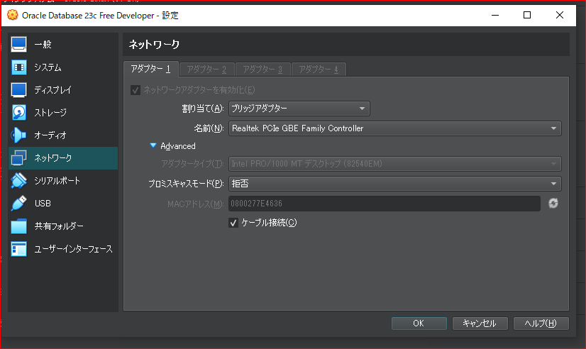

# oracleDBナレッジ

### 他コンテナから接続できない
原因、NATモードになっている



### lisnerが起動していない
原因⇒重複したポート番号を利用している
参考


```bash
[oracle@localhost admin]$ cat listener.ora
# listener.ora Network Configuration File: /opt/oracle/product/23c/dbhomeFree/network/admin/listener.ora
# Generated by Oracle configuration tools.

DEFAULT_SERVICE_LISTENER = FREE

LISTENER =
  (DESCRIPTION_LIST =
    (DESCRIPTION =
      (ADDRESS = (PROTOCOL = TCP)(HOST = localhost)(PORT = 1521)) #kizson
      (ADDRESS = (PROTOCOL = TCP)(HOST = 192.168.3.12)(PORT = 1522)) #gaibu
      (ADDRESS = (PROTOCOL = IPC)(KEY = EXTPROC1521))
    )
  )


[oracle@localhost admin]$ lsnrctl status

LSNRCTL for Linux: Version 23.0.0.0.0 - Production on 05-DEC-2023 14:20:10

Copyright (c) 1991, 2023, Oracle.  All rights reserved.

Connecting to (DESCRIPTION=(ADDRESS=(PROTOCOL=TCP)(HOST=localhost)(PORT=1521)))
STATUS of the LISTENER
------------------------
Alias                     LISTENER
Version                   TNSLSNR for Linux: Version 23.0.0.0.0 - Production
Start Date                05-DEC-2023 14:16:54
Uptime                    0 days 0 hr. 3 min. 15 sec
Trace Level               off
Security                  ON: Local OS Authentication
SNMP                      OFF
Default Service           FREE
Listener Parameter File   /opt/oracle/product/23c/dbhomeFree/network/admin/listener.ora
Listener Log File         /opt/oracle/diag/tnslsnr/localhost/listener/alert/log.xml
Listening Endpoints Summary...
  (DESCRIPTION=(ADDRESS=(PROTOCOL=tcp)(HOST=localhost)(PORT=1521)))
  (DESCRIPTION=(ADDRESS=(PROTOCOL=tcp)(HOST=192.168.3.12)(PORT=1522)))
  (DESCRIPTION=(ADDRESS=(PROTOCOL=ipc)(KEY=EXTPROC1521)))
Services Summary...
Service "0543b3ed61857640e0630100007f0bca" has 1 instance(s).
  Instance "FREE", status READY, has 1 handler(s) for this service...
Service "FREE" has 1 instance(s).
  Instance "FREE", status READY, has 1 handler(s) for this service...
Service "FREEXDB" has 1 instance(s).
  Instance "FREE", status READY, has 1 handler(s) for this service...
Service "freepdb1" has 1 instance(s).
  Instance "FREE", status READY, has 1 handler(s) for this service...
The command completed successfully
[oracle@localhost admin]$ 
```