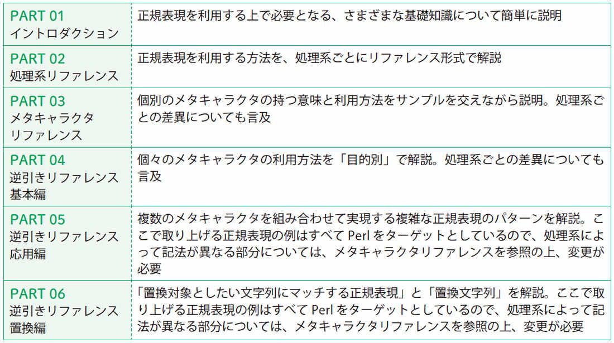

## 01　INTRODUCTION

## 02　処理系リファレンス
02-01　grep / egrep
02-01-01　文字列を検索する
02-02　sed
02-02-01　処理対象行を指定する
02-02-02　指定した文字列を置換する（sコマンド）
02-03　awk
02-03-01　指定した文字列を置換する
02-03-02　文字列に対するマッチを行う
02-03-03　処理対象レコードを指定する
02-04　vim
02-04-01　文字列を検索する
02-04-02　文字列を置換する
02-05　Perl

02-07　Java
02-07-01　正規表現オブジェクトを生成する
02-07-02　文字列に対するマッチを行う
02-07-03　マッチした内容を取り出す
02-07-04　文字列の置換を行う
02-08　JavaScript
02-08-01　RegExpオブジェクトの生成
02-08-02　文字列に対するマッチを行う
02-08-03　文字列の置換を行う

## 03　メタキャラクタリファレンス
03-01　基本正規表現
03-01-01　x　「その文字」自身にマッチ
03-01-02　\　メタキャラクタの持つ特別な意味を失わせる
03-01-03　.　任意の1文字にマッチ
03-01-04　[xyz]　指定された文字の中のいずれかにマッチ
03-01-05　(pattern)、\(pattern\)　部分正規表現のグルーピング
03-01-06　*　直前の正規表現と0回以上一致
03-01-07　{min,max}、\{min,max\}　直前の正規表現と指定回数一致

03-01-08　\$　文字列の末尾、または行終端子の直前にマッチ
03-01-09　^　文字列の先頭、または行終端子の直後にマッチ
03-01-10　\n　キャプチャ済みの部分正規表現に対する後方参照
03-01-11　[:..:]　POSIX文字クラス表現
03-01-12　[.ll.]　指定した照合要素にマッチ
03-01-13　[=e=]　指定した等価クラスに含まれる文字にマッチ
03-02　拡張正規表現
03-02-01　x|y、x\|y　正規表現xまたはyにマッチ
03-02-02　+、\+　直前の正規表現と1回以上一致
03-02-03　?、\?、\=　直前の正規表現と0回または1回一致
03-03　文字クラスエスケープ
03-03-01　\d、\D　任意の数字にマッチ / 数字以外の任意の1字にマッチ
03-03-02　\s、\S　任意の空白にマッチ / 空白以外の任意の文字にマッチ
03-03-03　\w、\W　任意の単語構成文字にマッチ / 単語構成文字以外の任意の文字にマッチ
03-03-04　\v、\V　任意の垂直方向の空白にマッチ / 垂直方向の空白以外の任意の1字にマッチ
03-03-05　\h、\H　任意の水平方向の空白にマッチ / 水平方向の空白以外の任意の1字にマッチ
03-04　制御文字とUnicode
03-04-01　\n、\a、\b、\e、\f、\r、\t　各種の制御文字にマッチ
03-04-02　\cx　xで指定した制御文字にマッチ
03-04-03　\nnn、\onnn　nnnに指定した8進表現で示される文字にマッチ
03-04-04　\xnn　nに指定した16進表現で示される文字にマッチ
03-04-05　\unnnn、\x{n}　nに指定したコードポイントで表現される文字にマッチ
03-04-06　\p{...}、\P{...}　Unicodeプロパティに基づく条件に合致する文字にマッチ
03-04-07　\N{...}　正式なUnicode文字名で表現される文字にマッチ
03-04-08　\x　Unicodeの書記素クラスタにマッチ
03-05　特殊な量指定子
03-05-01　*?、\{-}　直前の正規表現と0回以上一致（最短一致）
03-05-02　{min,max}?、\{-min,max}　直前の正規表現と指定回数一致（最短一致）
03-05-03　+?　直前の正規表現と1回以上一致（最短一致）
03-05-04　??　直前の正規表現と0回または1回一致（最短一致）
03-05-05　*+　直前の正規表現と0回以上一致（強欲）
03-05-06　{min,max}+　直前の正規表現と指定回数一致（強欲）
03-05-07　++　直前の正規表現と1回以上一致（強欲）
03-05-08　?+　直前の正規表現と0回または1回一致（強欲）
03-06　アンカー
03-06-01　\b、\B　単語の境界にマッチ / 単語の境界以外にマッチ
03-06-02　\<、\>　単語の先頭にマッチ / 単語の末尾にマッチ
03-06-03　\A　文字列の先頭にマッチ
03-06-04　\Z　文字列の末尾、あるいは文字列の末尾の行終端子の直前にマッチ
03-06-05　\z　文字列の末尾にマッチ
03-06-06　\G　前回のマッチの末尾にマッチ
03-06-07　\b{X}　Unicodeの書記素クラスタ / 単語 / 文の境界にマッチ
03-07　グループ化構成体
03-07-01　(?:pattern)　部分正規表現のグルーピング（キャプチャなし）
03-07-02　(?=pattern)　patternがこの位置の右に存在する場合にマッチ（肯定先読み）
03-07-03　(?!pattern)　patternがこの位置の右に存在しない場合にマッチ（否定先読み）
03-07-04　(?<=pattern)　patternがこの位置の左に存在する場合にマッチ（肯定戻り読み）
03-07-05　(?<!pattern)　patternがこの位置の左に存在しない場合にマッチ（否定戻り読み）
03-07-06　(?>pattern)　マッチ文字列に対するバックトラックを禁止する
03-07-07　(?(condition)yes-pattern)　conditionが成立した場合、yes-patternにマッチするかどうかを試す
03-07-08　(?P<name>pattern)、(?<name>pattern)　名前付きキャプチャ
03-08　修飾子
03-08-01　i修飾子　大文字/小文字の違いを無視する
03-08-02　c修飾子　マッチに失敗しても、前回のマッチ位置をリセットしない
03-08-03　d修飾子　UNIXラインモードにする
03-08-04　e修飾子　置換文字列をPerlコードとして評価し、その結果を利用する
03-08-05　g修飾子　繰り返しマッチを行う
03-08-06　m修飾子　マルチラインモードにする
03-08-07　o修飾子　正規表現を1回だけコンパイルする
03-08-08　s修飾子　シングルラインモードにする
03-08-09　u修飾子　Unicodeサポートの強化
03-08-10　x修飾子　パターン内で空白とコメントが利用可能となる
03-08-11　A修飾子　強制的に文字列先頭にマッチさせる
03-08-12　D修飾子　「$」を文字列の末尾にのみマッチさせる
03-08-13　U修飾子　「欲張り」と「無欲」の役割を反転させる(PHP)、文字クラスのマッチ対象をUnicodeベースにする(Java)
03-08-14　X修飾子　PCREの付加機能を有効にする
03-08-15　CANON_EQフラグ　等価とみなされる文字を同じ文字としてマッチ
03-08-16　(?modifier)、(?-modifier)　これ以降、指定した処理モードを利用する
03-08-17　(?modifier:pattern)、(?-modifier:pattern)　指定した処理モードを部分正規表現に適用する（クロイスタ）
03-08-18　y修飾子　前回のマッチ位置の直後にしかマッチさせない
03-08-19　a修飾子　ASCII文字のみのマッチングを行う
03-08-20　n修飾子　名前付きキャプチャのみをキャプチャする
03-09　変換とエスケープ
03-09-01　\l、\u　次の文字を小文字/大文字として扱う
03-09-02　\Q～\E　範囲内のすべての文字をエスケープする
03-09-03　\L～\E、\U～\E　範囲内のすべての文字を小文字/大文字として扱う
03-10　その他
03-10-01　(?# comment)　正規表現中のコメント
03-10-02　(?{code})　埋め込まれたコードを実行する
03-10-03　(??{code})　埋め込まれたコードを実行し、その結果を正規表現として使用
03-10-04　[a-z&&[bc]]　ブラケット表現内での集合演算
03-10-05　vim独自の文字クラス
03-10-06　vim独自の文字クラスエスケープ
03-10-07　\&　両方の選択肢にマッチした場合のみマッチ
03-10-08　&　マッチした内容に対する後方参照
03-10-09　\R、\N　各種の改行にマッチ / 改行以外の文字にマッチ
03-10-10　vim独自のメタキャラクタ

## 04　逆引きリファレンス 基本編
04-01　基本
04-01-01　文字「a」が連続している部分にマッチさせたい
04-01-02　「a」が5回続いた文字列にマッチさせたい
04-01-03　「Java SE」あるいは「JavaSE」にマッチさせたい
04-01-04　「boy」あるいは「girl」にマッチさせたい
04-01-05　「.」そのものにマッチさせたい
04-01-06　ある文字列から始まる行にマッチさせたい
04-01-07　ある文字列で終わる行にマッチさせたい
04-01-08　文字列の先頭/末尾にマッチさせたい
04-01-09　英数字にマッチさせたい
04-01-10　数字にマッチさせたい
04-01-11　空白にマッチさせたい
04-01-12　「book」という単語そのものにマッチさせたい
04-01-13　任意の単語にマッチさせたい
04-01-14　コード値で文字を指定したい
04-01-15　制御文字にマッチさせたい
04-01-16　大文字と小文字を区別せずにマッチさせたい
04-01-17　「a」以外の1文字にマッチさせたい
04-01-18　「c」と「x」を除くアルファベット小文字にマッチさせたい
04-01-19　最初に現れる「/」までにマッチさせたい
04-01-20　指定したパターンが繰り返し登場するかどうかを調べたい
04-01-21　「Japan」にはマッチするが「Japanese」にはマッチしない
04-01-22　「社長」にはマッチするが「副社長」にはマッチしない
04-01-23　ひらがな/カタカナ/漢字にマッチさせたい

## 05　逆引きリファレンス 応用編
05-00　応用編イントロダクション
05-00-00　応用編での正規表現について
05-01　一般
05-01-01　空白しかない行にマッチさせたい
05-01-02　まったく同じ文字/単語が連続する部分にマッチさせたい
05-01-03　文字列「abc」から始まらない行にマッチさせたい
05-01-04　文字列「abc」が含まれない行にマッチさせたい
05-01-05　大文字が3文字以上連続した単語にマッチさせたい
05-01-06　ダブルクォートで括られた文字列にマッチさせたい
05-01-07　小数にマッチさせたい
05-01-08　指数表記の数値にマッチさせたい
05-01-09　3桁区切りの数値にマッチさせたい
05-02　HTML / XML
05-02-01　URLにマッチさせたい
05-02-02　HTML内の色指定にマッチさせたい
05-02-03　HTMLのa要素からhref属性の値を抜き出したい
05-02-04　HTMLの見出し要素の内容を抜き出したい
05-02-05　HTML/XMLの開始タグにマッチさせたい
05-02-06　type属性がhidden以外のinput要素にマッチさせたい
05-03　日付 / 時刻
05-03-01　年月日の表現にマッチさせたい
05-03-02　「19:58:02」形式にマッチさせたい
05-04　プログラミング
05-04-01　郵便番号にマッチさせたい
05-04-02　電話番号にマッチさせたい
05-04-03　「キー=値」という形式にマッチさせたい
05-04-04　Windowsのフルパス形式にマッチさせたい
05-04-05　Windowsの特殊ファイル名にマッチさせたい
05-04-06　IPアドレス（IPv4）にマッチさせたい
05-04-07　ホスト名（FQDN）にマッチさせたい
05-04-08　パーセントエンコーディングにマッチさせたい
05-04-09　エンコードされたメールヘッダにマッチさせたい
05-04-10　クエリ文字列を分解したい
05-04-11　メールアドレスにマッチさせたい
05-05　プログラム解析
05-05-01　Cプログラムからインクルードされたファイルを抜き出したい
05-05-02　スクリプトからヒア・ドキュメントを抜き出したい

## 06　逆引きリファレンス 置換編
06-00　置換編イントロダクション
06-00-00　置換編での正規表現について
06-01　文書作成
06-01-01　行と行の間に空行を追加したい
06-01-02　文の区切りで改行を入れたい
06-01-03　行の先頭及び末尾の空白を削除したい
06-01-04　カンマの後ろのスペースを1つに統一したい
06-01-05　ピリオドの後ろのスペースを2つに統一したい
06-01-06　段落を保持したまま複数行を1行にしたい
06-01-07　英数字/英単語と日本語の文字の間にスペースを挟みたい
06-01-08　単語の先頭の文字を大文字に変換したい
06-01-09　各単語の先頭1文字から頭字語を作成したい
06-02　HTML / XML
06-02-01　「sample.html#p1」から、#より前/後の文字列を削除したい
06-02-02　「&」をすべて「&amp;」に置換したい
06-02-03　XMLの「<要素名/>」を「<要素名></要素名>」に変換したい
06-02-04　タグの外部にある「green」をすべて「yellow」に変換したい
06-02-05　HTML/XMLのコメントを削除したい
06-03　プログラミング
06-03-01　クエリ文字列から値が入っていないフォームデータを排除したい
06-03-02　「product_name」を「productName」に変換したい
06-03-03　「PRODUCT_NAME」を「productName」に変換したい
06-03-04　メールの引用符を取り除きたい
06-03-05　ファイル名から拡張子を除去したい
06-03-06　パス名からファイル名部分以外を除去したい
06-04　プログラム解析
06-04-01　Javaプログラムからコメントを削除したい
06-04-02　Perlプログラムからコメントを削除したい
06-04-03　Cプログラムからコメントを削除したい
