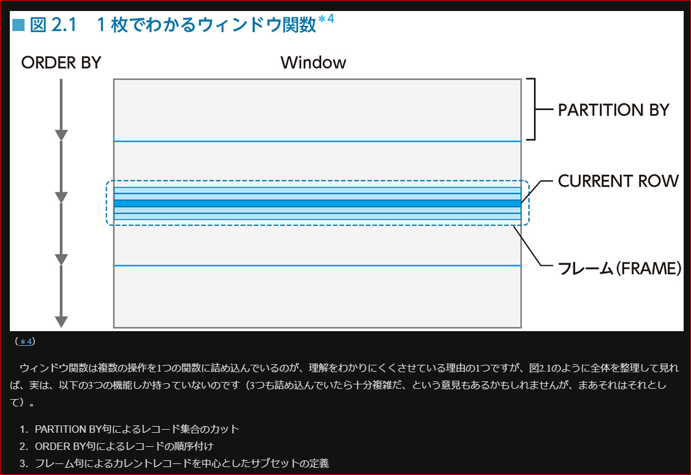

サンプル
https://www.shoeisha.co.jp/book/download/9784798157825

## 第1部　魔法のSQL
### 1　CASE式のススメ

```sql:case句にエイリアス設定
SELECT 
    CASE pref_name
        WHEN '徳島' THEN '四国'
        WHEN '香川' THEN '四国'
        WHEN '愛媛' THEN '四国'
        WHEN '高知' THEN '四国'
        WHEN '福岡' THEN '九州'
        WHEN '佐賀' THEN '九州'
        WHEN '長崎' THEN '九州'
        ELSE 'その他' 
    END AS region, -- ここでエイリアス 'region' を付ける
    COUNT(*)
FROM PopTbl
GROUP BY region; -- エイリアスを再利用

```

### 2　必ずわかるウィンドウ関数

1. ウィンドウ関数の「ウィンドウ」とは、（原則として順序を持つ）「範囲」という意味。
1. ウィンドウ関数の構文上では、PARTITION BY句とORDER BY句で特徴づけられたレコードの集合を意味するが、一般的に簡略形の構文が使われるため、かえってウィンドウの存在を意識しにくい。
1. PARTITION BY句はGROUP BY句から集約の機能を引いて、カットの機能だけを残し、ORDER BY句はレコードの順序を付ける。
1. フレーム句はカーソルの機能をSQLの構文に持ち込むことで、「カレントレコード」を中心にしたレコード集合の範囲を定義することができる。
1. フレーム句を使うことで、異なる行のデータを1つの行に持ってくることができるようになり、行間比較が簡単に行なえるようになった。
1. ウィンドウ関数の内部動作としては、現在のところ、レコードのソートが行なわれている。将来的にハッシュが採用される可能性もゼロではない。

### 3　自己結合の使い方
- 重複順列・順列・組み合わせ
- 重複行を削除する
- 部分的に不一致なキーの検索

### 4　３値論理とNULL
SQLの甘い罠
本題に入る前に
理論編
実践編
まとめ
演習問題
### 5　EXISTS述語の使い方
SQLの中の述語論理
理論編
実践編
まとめ
演習問題
### 6　HAVING句の力
世界を集合として見る
データの歯抜けを探す
HAVING句でサブクエリ──最頻値を求める
NULLを含まない集合を探す
HAVING句で全称量化
一意集合と多重集合
関係除算でバスケット解析
まとめ
演習問題
### 7　ウィンドウ関数で行間比較を行なう
さらば相関サブクエリ
はじめに
成長・後退・現状維持
時系列に歯抜けがある場合──直近と比較
ウィンドウ関数 vs. 相関サブクエリ
オーバーラップする期間を調べる
まとめ
演習問題
### 8　外部結合の使い方
SQLの弱点──その傾向と対策
はじめに
外部結合で行列変換：その１（行→列）──クロス表を作る
外部結合で行列変換：その２（列→行）──繰り返し項目を1列にまとめる
クロス表で入れ子の表側を作る
掛け算としての結合
完全外部結合
外部結合で集合演算
外部結合で差集合を求める──A－B
外部結合で差集合を求める──B－A
完全外部結合で排他的和集合を求める
まとめ
演習問題
### 9　SQLで集合演算
SQLと集合論
はじめに
導入──集合演算に関するいくつかの注意点
テーブル同士のコンペア──集合の相等性チェック［基本編］
テーブル同士のコンペア──集合の相等性チェック［応用編］
差集合で関係除算を表現する
等しい部分集合を見つける
重複行を削除する高速なクエリ
まとめ
演習問題
### 10　SQLで数列を扱う
SQLで順序を扱う──集大成
はじめに
連番を作ろう
欠番を全部求める
３人なんですけど、座れますか？
折り返しのある数列
単調増加と単調減少
まとめ
演習問題
### 11　SQLを速くするぞ
お手軽SQLパフォーマンスチューニング
はじめに
効率の良い検索を利用する
ソートを回避する
極値関数（MAX/MIN）でインデックスを使う
WHERE句で書ける条件はHAVING句には書かない
そのインデックス、本当に使われてますか？
中間テーブルを減らせ
まとめ
### 12　SQLプログラミング作法
宗教戦争をこえて
はじめに
テーブル設計
コーディングの指針
大文字と小文字
まとめ
## 第2部　リレーショナルデータベースの世界
### 13　RDB近現代史
データベースに破壊的イノベーションは二度起きるか？
リレーショナルデータベースの歴史
破壊的イノベーションは繰り返すか？
NoSQLの種類と解決策
パフォーマンス問題の解決
まとめ
### 14　なぜ“関係”モデルという名前なの？
なぜ“表”モデルという名前ではないのか？
関係の定義
定義域の憂鬱
関係値と関係変数
関係の関係は可能か？
### 15　関係に始まり関係に終わる
閉じた世界の幸せについて
演算から見た集合
実践と原理
### 16　アドレス、この巨大な怪物
なぜリレーショナルデータベースにはポインタがないのか？
はじめに
関係モデルはアドレスから自由になるために生まれた
プログラミングに氾濫するアドレス
去り行かない老兵──バッカスの夢
### 17　順序をめぐる冒険
SQLのセントラルドグマ
遅れてきた主役
行に順序はあるべきか？
### 18　GROUP BY と PARTITION BY
類は友を呼ぶ
その違いわかりますか？
### 19　手続き型から宣言型・集合指向へ頭を切り替える７箇条
円を描く
はじめに
１．IF文やCASE文は、CASE式で置き換える。SQLはむしろ関数型言語と考え方が近い
２．ループはGROUP BY句とウィンドウ関数で置き換える
３．テーブルの行に順序はない
４．テーブルを集合と見なそう
５．EXISTS述語と「量化」の概念を理解しよう
６．HAVING句の真価を学ぶ
７．四角を描くな、円を描け
### 20　神のいない論理
論理学の歴史をちょっとだけ
汝、場合により命題の真偽を捨てよ
論理学の革命
人間のための論理
### 21　SQLと再帰集合
SQLと集合論の深い仲
実務の中の再帰集合
ノイマンの先輩たち
数とは何か？
SQLの魔術と科学
### 22　NULL撲滅委員会
万国のDBエンジニア、団結せよ！
決意表明～スベテノ DBエンジニア ニ 告グ～
なぜNULLがそんなに悪いのか？
しかしNULLを完全に排除することはできない
コードの場合──未コード化用コードを割り振る
名前の場合──「名無しの権兵衛」を割り振る
数値の場合──０で代替する
日付の場合──最大値・最小値で代替する
指針のまとめ
### 23　SQLにおける存在の階層
厳しき格差社会
述語論理における階層、集合論における階層
なぜ集約すると、もとのテーブルの列を参照できなくなるのか？
単元集合も立派な集合です！
## 第3部　付録
A　演習問題の解答
B　参考文献
SQL全般
データベース設計
パフォーマンス
集合論と述語論理／３値論理
おわりに
検索キーワード
「Column」　
なぜONではなくOVERなのか？
SQLとフォン・ノイマン
文字列とNULL
関係除算
HAVING句とウィンドウ関数