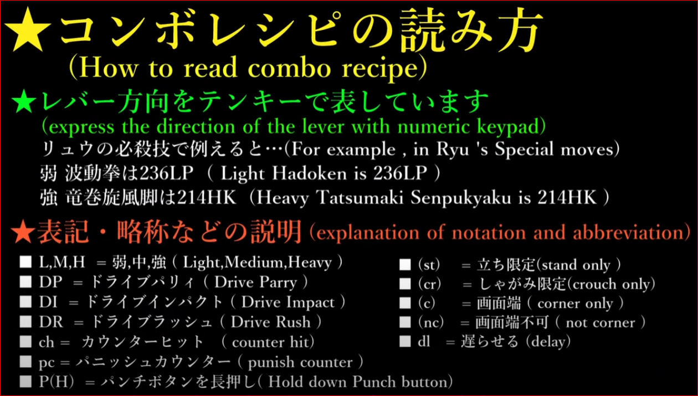

###

- 飛び
- ラッシュ
- OD強臭突
- 壁コンは基本的に詐欺飛びルートとかインパクト重ね、中段重ねや弾重ねに

※P(poison),TB(Toxic Blossom)時有り
fr(foward recive),br(back recive)

- 【1266】2LP*3 > 236HP(+44,+53TB)
    - J2HP(+2)
- 【1674】(c,Poioson) 2LP*3 > 236HP > 214HP(+53TB)
    - 214MP(+7)
- 【1660】(st,Poison) 2LK > 2LP > LK > 246MP(TB) (+62TB)> (SA2)
    - 236HK(+4)

- 【1306】(Poison)2MK > LK > 236LP
    - 236HK(+1)
- 【2836】JHP > MK > MP > 214LP(+44)
  - (fr) 2HP
  - (br) HP
- 【3000】JHP > MK > MP > 236HP(TB) > 236P(+39)
  - 236HK(-4)

- 【2916】(NoPoison)JHP > HK > 2PP.K > 2LP*2 > 236HP(+44)

- 【3377】(Poison)JHP > HK > LK > 236MP(TB) > LK > 236HP(+44)

- 【3559】(c,Poison)JHP > HK > 2PP.K > LK > 236MP(TB) > HK > 214HP(+56)
    - 【4365】(CR) > HK > 2PP.P > SA1(+30)

- ~~【3893】(c,Poison)HKpc > 214HK > LK > 236MP(TB) > HK > 2PP.K > 236P(+36) ~~

- 【2726】DIpc > HK > 2PP.K > 2LP*2 > 236HP(+44)

- 【2951】DI(STUN) > 214MP > JHP > HK > 236MP(TB) > HK > 236MP(TB) > 236HP(+46)

- 【2526】DR.2MK > HK > 2PP.K > LK > 236MP(+44)

- 【2811】(poison)DR.2MK > HK > 2PP.K > LK > 236MP(TB) > LK > 236HP(+47)

- 【6946】(c,Poison)HKpc > 2PP.P(TB) > HK > 236PP(TB) > DR.HK > 214KK > 236LP(TB) > 214PP.6P > 236236P()

### 立ち回り
    - 214PP > ラッシュ

### 参考動画
【202405ver】ストリートファイター6 A.K.I. 基本 コンボ【 STREET FIGHTER 6 A.K.I. BASIC COMBOS 】
https://www.youtube.com/watch?v=oYAFZ7C-jkg

### 立ち回り
#### 近づく時
    大P -> （SA仕込み） -> 大P（TP）
    中P -> 強紫泡撒（入れ込み）
    中P -> 弱蛇頭鞭（入れ込み）

#### OD使いたいとき
    OD凶襲突（投げ） （ガード有利, 起き攻めアリ
        - 蛇軽功
          - 投げ
          - 下弱k - 下弱P -> 強蛇頭弁

#### ラッシュ
    下中K（ガード+5, ガード時離れる）
        - 大K
        - 
        

    下中P（ガード+1, ガード時近い）
        - （ガード時）投げ
        - 強鞭〆コン

#### 弾
    基本、OD弾撃って歩き

        OD弾 -> ガード確認後 -> ラッシュ
                                    -> 下弱K
                                    -> 下弱P

#### 起き攻め
    固めたいとき
        - 前大K

#### 対空
    立大K、下大K
        -> 中蛇頭鞭

    （相手毒）
        強蛇頭弁 -> (ラッシュ) -> 大K -> 猛毒牙

#### 相手BO時
    (下中P -> 中P -> 蛇連咬) * n回 4回目ぐらいから離れ始める
    - (大Kインパクト)

### 基本コンボ

下小P*2 > 強波動　
（毒無し）
    ->> うねうねで+5、相打ちで+9
    ->> （後方受け身）-> 投げ重ね
        ->> 最速投げ時 -> シミー
（毒付き）
    ->> ラッシュ -> 大K
    ->>

凶襲突 -> 蛇頭弁（大）

大K -> （構え -> K） (-> ガード時パリィで様子見)

★アプデ後
下中K -> 立弱K -> 中蛇頭鞭 -> SA3

### 玉
    弾と同時に中段

###
けん制：立ち中K、弱蛇頭鞭（236＋弱P）
対空：立ち強K、しゃがみ強K、強蛇頭鞭（236＋強P）
飛び込み：ジャンプ強P、ジャンプ2強P（めくり）
切り返し：OD蛇軽功（236＋KK）

###
大Kパニカン -> 大K -> 中K -> 中P -> 弱紫煙 -> （棒） -> SA3

### 

下中P（パニカン）　-> 立P -> 強蛇頭弁 -> SA3

###
（ラッシュ） 下中K -> 大K -> 構え(k) -> 弱K -> 中蛇頭弁 -> 弱K -> 強紫煙砲 
                                                                    -> (端) -> ラッシュ大K -> 猛毒牙 -> 毒設置

### 対空
強蛇頭弁 -> OD引き寄せ -> 中蛇頭弁 -> 弱蛇頭弁 
強蛇頭弁 -> OD引き寄せ -> 強蛇頭弁 -> 毒設置 

中P(CH) -> ラッシュ -> 中K -> 大K -> (悪鬼蛇行 -> 蛇連咬 ) -> 下弱P * 2 -> 蛇頭弁（大）
    -> 端：中P（空振り） -> 投げ（重ね）

### 画面端

画面端、紫泡撤＞ドライブラッシュ立ち強K＞猛毒牙～毒設置（+38F）からの起き攻め
1、（固め択）紫煙砲(214＋弱P)12F有利～6＋強K等
2、（中段択）立ち弱Pスカ（＋25F）＞3＋中P持続ヒット＞弱Kラッシュコンボ
3、（インパクト択）立ち弱Pスカ（＋25F）＞ドライブインパクト重ね
4、（安全択）バクステ＞立ち弱Pスカ＞紫煙砲(22F有利)＞6＋強K or 悪鬼蛇行～雁字搦め
5、（安全飛び）しゃがみ強Pスカ＞ジャンプ強P（5F詐欺）